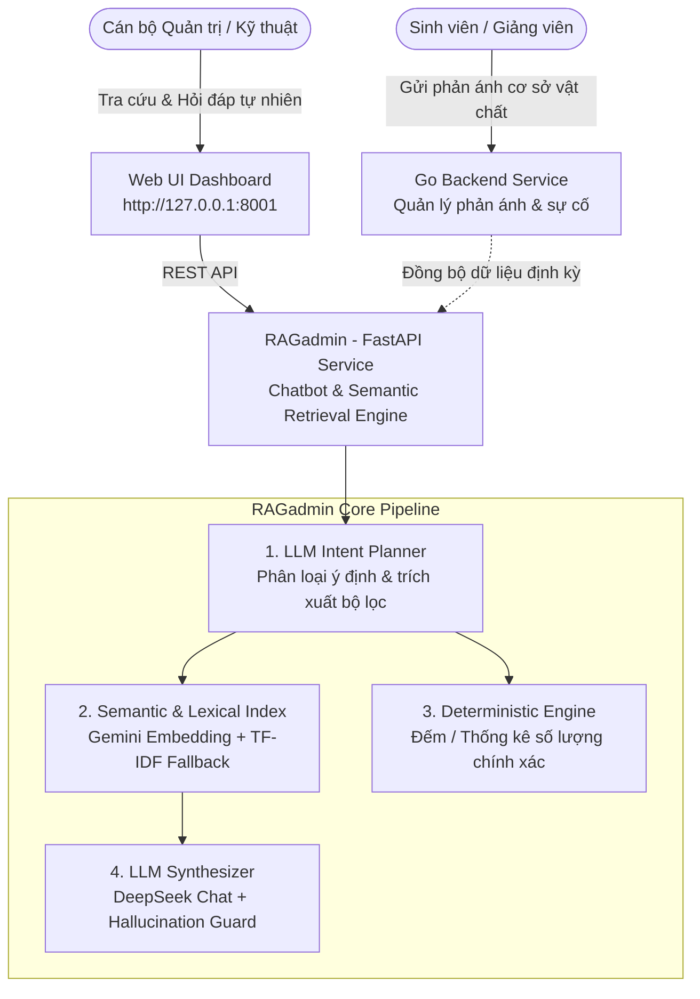

# Cập nhật CSV

Xem [CSV_HUONG_DAN.md](CSV_HUONG_DAN.md) để dùng dữ liệu mẫu của Tuấn và xử lý tiêu đề cột sai.

# 🏫 CampusPulse — Hệ Thống Giám Sát & Trợ Lý AI Quản Trị Cơ Sở Vật Chất Học Đường

> **CampusPulse** là giải pháp thông minh hỗ trợ quản lý, tiếp nhận và phân tích các phản ánh về cơ sở vật chất (mạng Wi-Fi, thang máy, máy chiếu, điều hòa, phòng học...) trong khuôn viên trường học. Hệ thống tích hợp **RAG Admin Chatbot** ứng dụng mô hình ngôn ngữ lớn (LLM) và tìm kiếm ngữ nghĩa (Semantic Search) giúp cán bộ quản trị tra cứu, thống kê và tổng hợp sự cố tức thì với độ chính xác cao và chống ảo giác (Anti-Hallucination).

---

## 📌 Mục Lục

- [Tổng Quan Kiến Trúc](#-tổng-quan-kiến-trúc)
- [Các Tính Năng Nổi Bật](#-các-tính-năng-nổi-bật)
- [Cấu Trúc Thư Mục](#-cấu-trúc-thư-mục)
- [Cấu Hình & Yêu Cầu Kỹ Thuật](#-cấu-hình--yêu-cầu-kỹ-thuật)
- [Hướng Dẫn Cài Đặt & Chạy Nhanh](#-hướng-dẫn-cài-đặt--chạy-nhanh)
  - [1. Chạy RAGadmin Chatbot (Python / FastAPI)](#1-chạy-ragadmin-chatbot-python--fastapi)
  - [2. Chạy Demo qua Batch Script (Windows)](#2-chạy-demo-qua-batch-script-windows)
- [Tài Liệu API (RAGadmin Endpoints)](#-tài-liệu-api-ragadmin-endpoints)
- [Cơ Chế RAG & Chống Ảo Giác](#-cơ-chế-rag--chống-ảo-giác)
- [Kiểm Thử (Testing)](#-kiểm-thử-testing)
- [Lộ Trình Phát Triển](#-lộ-trình-phát-triển)

---

## 🏛️ Tổng Quan Kiến Trúc

Hệ sinh thái **CampusPulse** bao gồm 3 phân hệ chính:



1. **`RAGadmin` (Python / FastAPI)**:
   - Trợ lý AI hỏi đáp dữ liệu phản ánh dành riêng cho quản trị viên.
   - Kết hợp **Gemini Text Embedding** và **DeepSeek Chat** (tự động chuyển đổi mượt mà sang **TF-IDF + Rules offline** khi mất mạng/hết quota).
   - Cơ chế truy xuất kết hợp (Semantic Search + TF-IDF) và tính toán số liệu tất định.
2. **`go_backend` (Go / Golang)**:
   - Dịch vụ backend quản lý dữ liệu gốc: `Observation` (phản ánh), `Incident` (sự cố gom nhóm), `User` (người dùng).
   - Quản lý vòng đời sự cố: `EMERGING` ➔ `CONFIRMED` ➔ `IN_PROGRESS` ➔ `RESOLVED`.
3. **`python_service`**:
   - Dịch vụ mở rộng hỗ trợ document loading, BM25, hybrid retrieval và reranker nâng cao.

---

## ✨ Các Tính Năng Nổi Bật

- 🎯 **Hiểu ngôn ngữ tự nhiên đa ý định (Intent Recognition)**:
  - `search`: Tìm kiếm thông tin phản ánh theo ngữ nghĩa (ví dụ: *"Thang máy H2 bị lỗi gì?"*, *"Mạng chập chờn ở tòa nào?"*).
  - `count`: Thống kê số lượng phản ánh / sự cố kèm gom nhóm theo tòa nhà, danh mục, trạng thái (ví dụ: *"Có bao nhiêu phản ánh về máy chiếu?"*).
  - `list`: Liệt kê phản ánh theo mốc thời gian (hôm nay, theo ngày, theo khoảng ngày).
  - `summary`: Tổng hợp toàn bộ các phản ánh theo danh mục mà không bị cắt xén context.
  - `lookup`: Tra cứu nhanh theo mã phản ánh cụ thể (`[PA{id}]`).
  - `clarification`: Tự động hỏi lại khi thông tin câu hỏi quá chung chung hoặc vượt ngưỡng ứng viên.
- 🛡️ **Kiểm soát ảo giác nghiêm ngặt (Strict Hallucination Guard)**:
  - Mọi câu trả lời của LLM **bắt buộc** phải trích dẫn định dạng nguồn `[PA{id}]` có thực trong danh sách truy xuất.
  - Tự động kiểm tra đối chiếu (Cross-validation) mã nguồn được trích dẫn; nếu phát hiện sai lệch sẽ fallback về dữ liệu thô.
- 🔢 **Thống kê tất định (Deterministic Statistics)**:
  - Số lượng phản ánh và sự cố được tính toán bằng code logic (Python), tuyệt đối không để LLM tự đoán số lượng (loại bỏ lỗi đếm sai kinh điển của mô hình ngôn ngữ).
- 🔄 **Cơ chế Fallback thông minh 2 tầng (Graceful Degradation)**:
  - Nếu API Cloud (Gemini / DeepSeek) gặp sự cố mạng hoặc hết hạn mức, hệ thống tự động lùi về bộ lọc quy tắc (Rule-based) và tìm kiếm từ khóa TF-IDF offline, đi kèm thông báo cảnh báo rõ ràng.
- ⚡ **Snapshot & Bộ nhớ đệm hiệu năng cao**:
  - Dữ liệu được nạp vào RAM theo cấu trúc Snapshot bất biến (Thread-safe).
  - Cache vector embedding trong RAM giúp tiết kiệm chi phí gọi API và tăng tốc độ phản hồi.

---

## 📂 Cấu Trúc Thư Mục

```text
CampusPulse/
├── RAGadmin/                       # Phân hệ Trợ lý AI Quản trị (RAG Admin)
│   ├── data/
│   │   └── phananh.json            # Dữ liệu mẫu các phản ánh thực tế
│   ├── static/                     # Giao diện Web Admin (HTML, CSS, JS)
│   │   ├── index.html
│   │   ├── style.css
│   │   └── app.js
│   ├── tests/                      # Bộ kiểm thử đơn vị & tích hợp
│   │   ├── test_chatbot.py
│   │   ├── test_cloud_provider.py
│   │   ├── test_count_intent.py
│   │   ├── test_list_today.py
│   │   └── test_llm_planner.py
│   ├── app.py                      # FastAPI Web Application & Middleware
│   ├── config.py                   # Quản lý cấu hình & biến môi trường
│   ├── index.py                    # Chỉ mục tìm kiếm Semantic (Cosine) & TF-IDF
│   ├── planner.py                  # Phân loại câu hỏi & trích xuất bộ lọc
│   ├── providers.py                # Tích hợp Cloud AI (Gemini Embedding + DeepSeek LLM)
│   ├── query.py                    # Lõi phân tích truy vấn rule-based
│   ├── rag.py                      # Bộ điều phối RAG chính (Chatbot engine)
│   ├── schemas.py                  # Pydantic Schemas cho API
│   ├── sources.py                  # Đọc & tiền xử lý nguồn dữ liệu
│   ├── start_ai.py                 # Script tự động kiểm tra kết nối AI & chạy app
│   ├── test_llm.py                 # Script kiểm thử nhanh LLM Planner & Answer
│   ├── test_retrieval.py           # Script kiểm thử độ chính xác truy xuất
│   ├── run_demo.bat                # Khởi động demo nhanh trên Windows
│   ├── run_ai.bat                  # Khởi động kèm xác thực AI trên Windows
│   ├── requirements.txt            # Thư viện phụ thuộc chính
│   ├── .env.example                # File mẫu cấu hình biến môi trường
│   └── .env                        # File cấu hình biến môi trường thực tế
│
├── go_backend/                     # Phân hệ Backend chính (Golang)
│   ├── models/                     # Data models (Incident, Observation, User)
│   ├── go.mod
│   └── main.go
│
├── python_service/                 # Phân hệ xử lý dữ liệu & NLP mở rộng
│   ├── core/                       # Config, logger, exceptions
│   └── knowledge_base/             # BM25, Document Loader, Vector Store
│
└── README.md                       # Tài liệu hướng dẫn dự án
```

---

## ⚙️ Cấu Hình & Yêu Cầu Kỹ Thuật

### Yêu Cầu Môi Trường
- **Python**: 3.10 trở lên (khuyên dùng Python 3.11).
- **Go**: 1.21 trở lên (nếu chạy phân hệ `go_backend`).
- Hệ điều hành: Windows / macOS / Linux.

### Cấu Hình Biến Môi Trường (`RAGadmin/.env`)

Tạo file `.env` bên trong thư mục `RAGadmin/` dựa theo mẫu `.env.example`:

```ini
# Chế độ ứng dụng: 'demo' (giao diện web local) hoặc 'internal' (yêu cầu API Key)
APP_MODE=demo
INTERNAL_API_KEY=your_secret_internal_key_here
DATA_MODE=mock
REPORTS_PATH=data/rag_knowledge.csv

# Chế độ AI: 'cloud' (Gemini Embedding + DeepSeek Chat) hoặc 'offline'
AI_MODE=cloud
AI_REQUIRED=false

# API Keys cho Cloud AI
DEEPSEEK_API_KEY=your_deepseek_api_key
GEMINI_API_KEY=your_gemini_api_key

# Tên mô hình AI
EMBED_MODEL=gemini-embedding-001
CHAT_MODEL=deepseek-chat

# Cấu hình thời gian chờ & ngưỡng điểm tương đồng
AI_TIMEOUT=60
SEMANTIC_MIN_SCORE=0.35
```

---

## 🚀 Hướng Dẫn Cài Đặt & Chạy Nhanh

### 1. Chạy RAGadmin Chatbot (Python / FastAPI)

Mở terminal tại thư mục `CampusPulse/RAGadmin`:

```bash
# 1. Tạo và kích hoạt môi trường ảo
python -m venv .venv

# Trên Windows:
.venv\Scripts\activate
# Trên Linux/macOS:
# source .venv/bin/activate

# 2. Cài đặt các thư viện cần thiết
pip install -r requirements.txt

# 3. Khởi chạy ứng dụng
python start_ai.py
```

Sau khi khởi chạy thành công, mở trình duyệt tại: **`http://127.0.0.1:8001`**

### 2. Chạy Demo qua Batch Script (Windows)

Nếu sử dụng Windows, bạn có thể chạy trực tiếp:
- **`run_demo.bat`**: Tự động tạo venv, cài đặt thư viện và khởi động Web Server.
- **`run_ai.bat`**: Kiểm tra kết nối Gemini + DeepSeek trước khi mở Web Server.

---

## 🔌 Tài Liệu API (RAGadmin Endpoints)

| Phương thức | Endpoint | Mô tả | Yêu cầu xác thực |
| :--- | :--- | :--- | :--- |
| `GET` | `/health` | Kiểm tra tình trạng hoạt động và tính sẵn sàng của bot | Không |
| `GET` | `/internal/admin/status` | Xem chi tiết trạng thái bộ nhớ, số lượng báo cáo, AI mode | Header `X-Internal-Key` (nếu `internal`) |
| `POST` | `/internal/admin/sync` | Đồng bộ và làm mới Snapshot dữ liệu phản ánh | Header `X-Internal-Key` (nếu `internal`) |
| `POST` | `/internal/admin/chat` | Gửi câu hỏi của quản trị viên và nhận phản hồi RAG | Header `X-Internal-Key` (nếu `internal`) |

### Ví Dụ Gửi Câu Hỏi (`POST /internal/admin/chat`)

**Request Body:**
```json
{
  "question": "Thang máy tòa H2 có vấn đề gì?",
  "top_k": 5
}
```

**Response Body:**
```json
{
  "answer": "Theo phản ánh ghi nhận, thang máy tòa H2 gặp tình trạng không mở cửa ở tầng 2. [PA7]\nMột phản ánh khác cho biết thang máy H2 dừng đột ngột giữa tầng 2 và tầng 3. [PA6]\nCả hai phản ánh về thang máy H2 đều đang ở trạng thái xử lý (incident IN_PROGRESS). [PA6] [PA7]",
  "intent": "search",
  "retrieval_mode": "semantic",
  "generation_mode": "llm",
  "understanding_mode": "llm",
  "warnings": [],
  "sources": [
    {
      "report_id": 7,
      "incident_id": 3,
      "building": "H2",
      "floor": "2",
      "room": null,
      "category": "ELEVATOR",
      "raw_text": "Thang máy H2 không mở cửa ở tầng 2, bấm nút cứu hộ mới ra được.",
      "incident_status": "IN_PROGRESS",
      "created_at": "2026-10-02T10:15:00+07:00"
    },
    {
      "report_id": 6,
      "incident_id": 3,
      "building": "H2",
      "floor": "2",
      "room": null,
      "category": "ELEVATOR",
      "raw_text": "Thang máy H2 bị kẹt giữa tầng 2 và tầng 3, mất điện bên trong.",
      "incident_status": "IN_PROGRESS",
      "created_at": "2026-10-02T10:10:00+07:00"
    }
  ]
}
```

---

## 🧠 Cơ Chế RAG & Chống Ảo Giác

1. **Phân tích truy vấn (Query Planning)**:
   - Trích xuất ý định câu hỏi (`kind`), thực thể mục tiêu (`entity`: phản ánh hay sự cố), tòa nhà (`building`), tầng (`floor`), phòng (`room`), nhóm phân loại (`category`), ngày phát sinh.
2. **Tìm kiếm lai kết hợp (Hybrid Retrieval)**:
   - Lọc trước (Pre-filtering) theo metadata cứng (Tòa nhà, tầng, phòng, danh mục).
   - Truy xuất vector ngữ nghĩa bằng Cosine Similarity giữa câu hỏi và văn bản phản ánh qua **Gemini Embedding**.
   - Nếu điểm số tương đồng không đạt ngưỡng `SEMANTIC_MIN_SCORE` hoặc AI offline, hệ thống tự động sử dụng **TF-IDF Token Matcher**.
3. **Tổng hợp & Xác thực kết quả (Synthesis & Anti-Hallucination)**:
   - LLM nhận dữ liệu phản ánh đã lọc kèm nguyên tắc nghiêm ngặt: chỉ được trả lời dựa trên bằng chứng cung cấp.
   - Hàm `validate_answer` kiểm tra định dạng trích dẫn: mọi `[PA{id}]` trong câu trả lời phải nằm trong tập `selected` IDs. Nếu LLM tự bịa ra thông tin không có nguồn, kết quả sẽ bị hủy và hệ thống fallback về dữ liệu trích xuất nguyên bản.

---

## 🧪 Kiểm Thử (Testing)

Dự án cung cấp bộ kiểm thử toàn diện cho cả Retrieval, Intent Planner và Chatbot:

```bash
cd CampusPulse/RAGadmin

# 1. Kiểm tra toàn diện pipeline LLM (DeepSeek / Gemini)
python test_llm.py

# 2. Kiểm tra độ chuẩn xác của tầng truy xuất (Retrieval accuracy)
python test_retrieval.py

# 3. Chạy toàn bộ unit test với pytest
pytest tests/ -v
```

---

## 🗺️ Lộ Trình Phát Triển

- [x] Triển khai RAG Admin Chatbot với Semantic Search và LLM Synthesizer.
- [x] Tích hợp cơ chế Fallback Offline (TF-IDF + Rules).
- [x] Xây dựng giao diện Web Dashboard cho Quản trị viên.
- [ ] Mở rộng kết nối cơ sở dữ liệu thời gian thực (PostgreSQL / SQLite) qua Go Backend.
- [ ] Hỗ trợ nhận diện và mô tả sự cố tự động từ hình ảnh sinh viên gửi lên (Multimodal Vision RAG).
- [ ] Hệ thống thông báo cảnh báo sự cố diện rộng tự động qua Webhook / Telegram Bot cho đội ngũ kỹ thuật.

---

*Phát triển cho giải pháp Quản trị Thông minh Cơ sở Vật chất Học đường — CampusPulse.*
